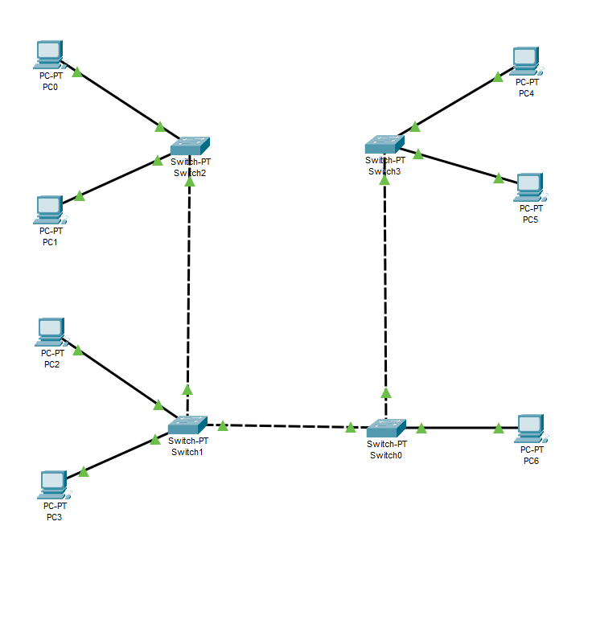
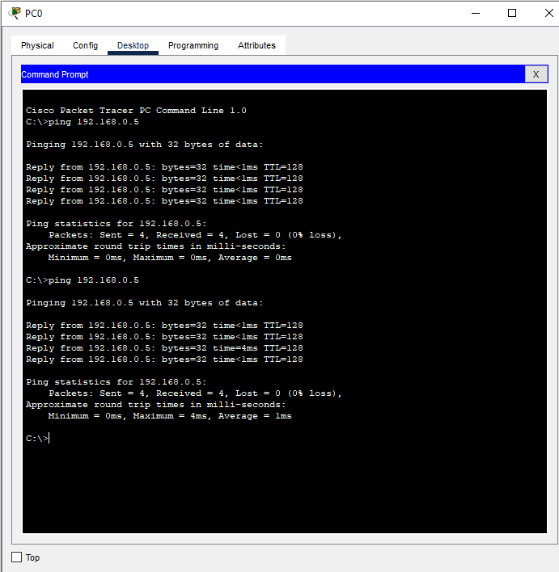
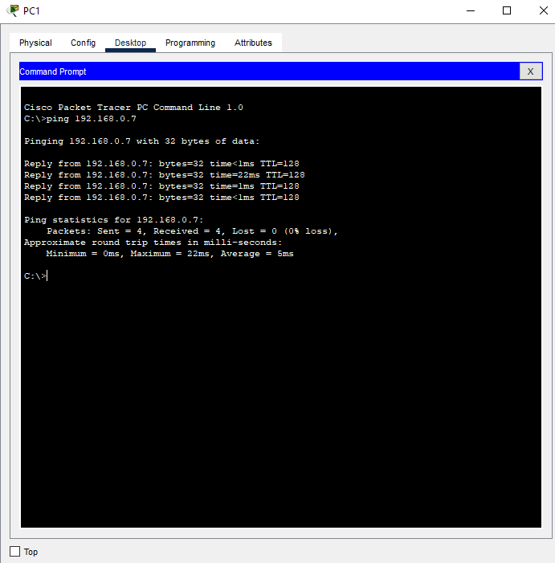
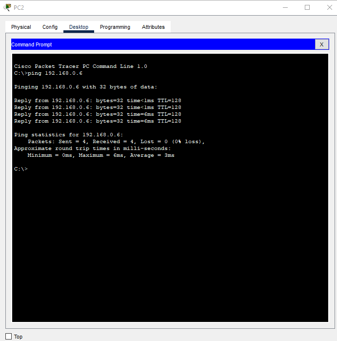
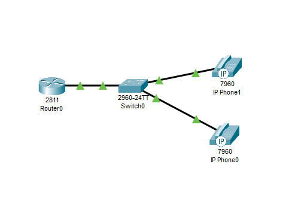
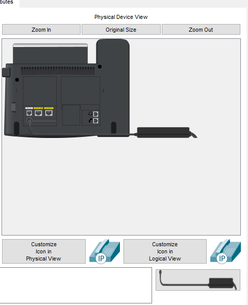
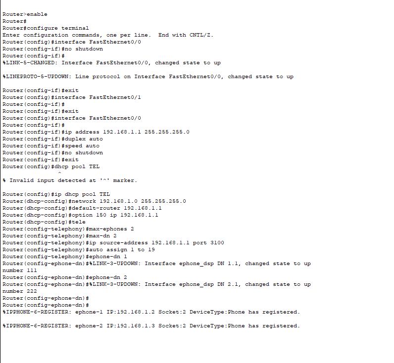
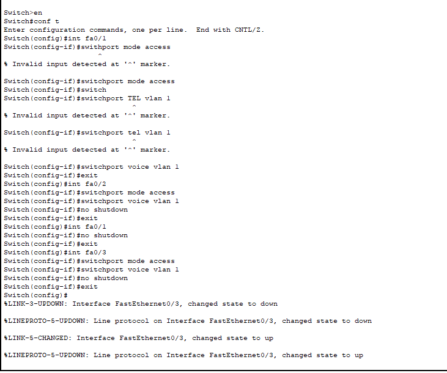
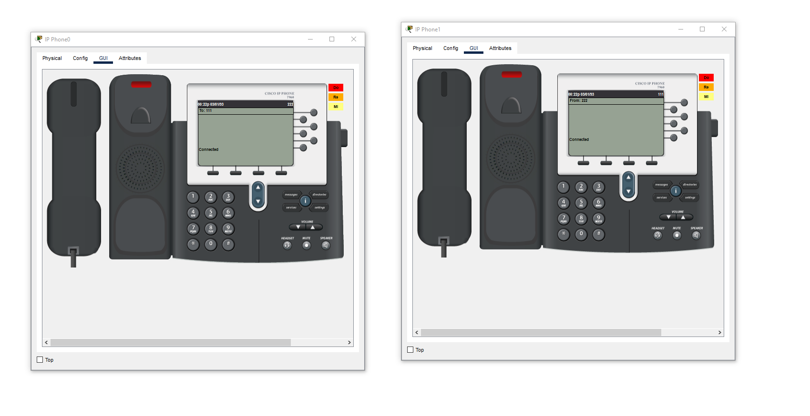

University: [ITMO University](https://itmo.ru/ru/)

Course: [IP-telephony](https://itmo-ict-faculty.github.io/ip-telephony/)

Year: 2024/2025

Group: K34212

Author: Petrov Dmitriy Konstantinovich
Lab: Lab1

Date of create: 25.04.2025

Date of finished: 25.04.2025

## Отчет по лабораторной работе №1:
### "Базовая настройка ip-телефонов в среде Сisco packet tracer"

#### 1. Цель:
Изучить рабочую среду Cisco Packet Tracer, ознакомиться с интерфейсами основных устройств, типами кабелей, научиться собирать,топологию. Изучить построение сети IP-телефонии с помощью маршрутизатора, коммутатора и IP телефонов Cisco 7960 в среде Packet tracer

#### 2. Ход работы:

#### Часть 1

Схема для первой части работы представлена на рисунке ниже

Каждому компьютеру был задан статический ip адрес, после чего были проведены проверки связности между устройствами

#### Часть 2

Схема второй части работы:

Сперва включим телефоны:

После чего была произведена настройка роутера. Был создан DHCP пул, активирована настройка 150, которая позволяет телефонам
получать настройки CallManager Express с TFTP сервера. После была произведена настройка telephony-service. Было задано: максимальное количество номеров для телефонов,
максимальное количество поддерживаемых телефонов, а также указан адрес голосового шлюза. После, было выполнено автоматическое назначение
внешних номеров. В конечном итоге были заданы номера Ip телефонов.

Далее настроим VLAN на свитче:

Проверяем возможность дозвониться

