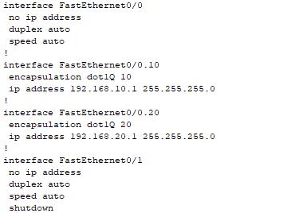

University: [ITMO University](https://itmo.ru/ru/)

Course: [IP-telephony](https://itmo-ict-faculty.github.io/ip-telephony/)

Year: 2024/2025

Group: K34212

Author: Petrov Dmitriy Konstantinovich

Lab: Lab2

Date of create: 25.04.2025

Date of finished: 25.04.2025

## Отчет по лабораторной работе №2:
### "Конфигурация voip в среде Сisco packet tracer"

#### 1. Цель:
Изучить построение сети IP-телефонии с помощью маршрутизатора Cisco 2811, коммутатора Cisco catalyst 3560 и IP телефонов Cisco 7960.

#### 2. Ход работы:

#### Часть 1

Схема 1:

Сначала был настроен роутер. Было изменено имя, далее был отключен синтаксис ввода слов от DNS серверов,
затем был выдан ip адрес интерфейсу fa0/0 и настроен DHCP пул для голосовой сети.

После был настроен свитч:

Далее были настроены номера телефонов:

Попытки звонков:

#### Часть 2

Была собрана схема, согласно заданию

Были созданы вланы для звонков и данных, после чего порт fa0/1 переведен в trunk режим, а порты fa0/2-4 в access режим.

 

Далее были настроены два DHCP сервера

Далее были созданы логические подинтерфейсы с инкапсуляцией Dot1Q, а также настроен телефонный сервис и выданы номера для телефонов

Далее были разданы ip адреса для компьютеров посредством DHCP

Проверим связность

Совершим звонок

