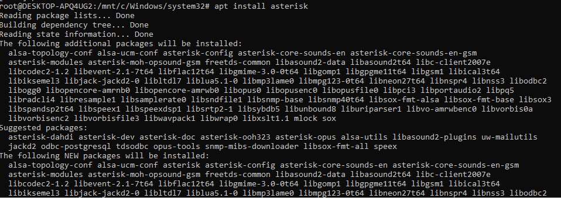
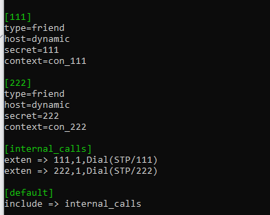
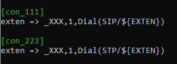
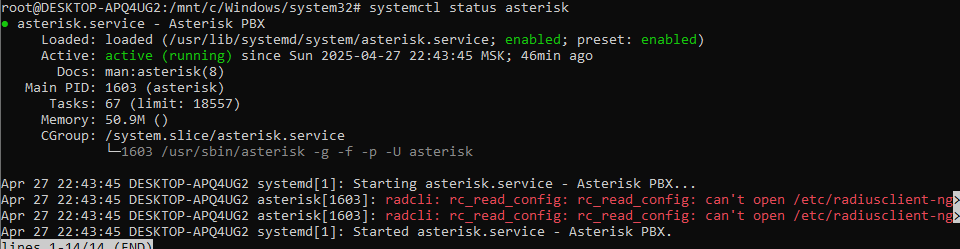
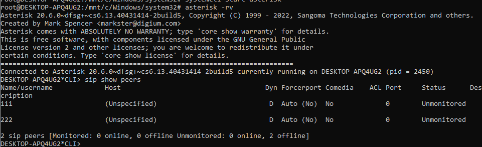
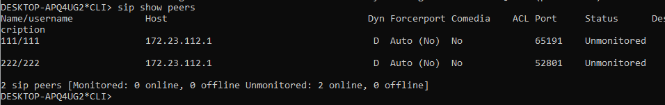
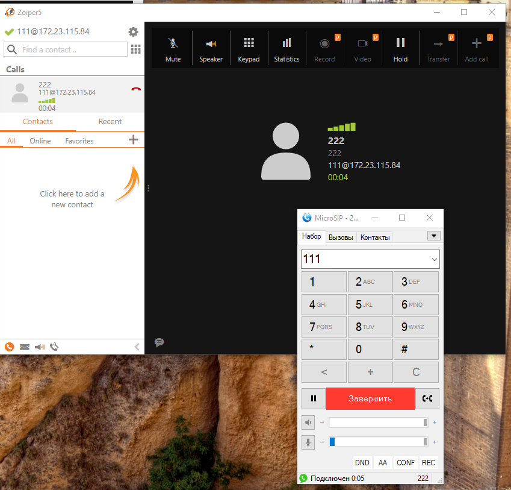

University: [ITMO University](https://itmo.ru/ru/)

Course: [IP-telephony](https://itmo-ict-faculty.github.io/ip-telephony/)

Year: 2024/2025

Group: K34212

Author: Petrov Dmitriy Konstantinovich

Lab: Lab3

Date of create: 26.04.2025

Date of finished: 28.04.2025

## Отчет по лабораторной работе №1:
### "Использование Asterisk в качестве SIP proxy"

#### 1. Цель:
Изучить программный комплекс Asterisk. Настройка Asterisk для локальных звонков.
#### 2. Ход работы:

Устанавливаем Asterisk

Производим конфигурацию телефонах в файлах sip.conf и extensions.conf

Проверяем работу asterisk

Далее были проверены созданные sip peers

После подключения через зойпер и микросип, проверили sip астерикса

Проверим вызов с одного телефона на другой

